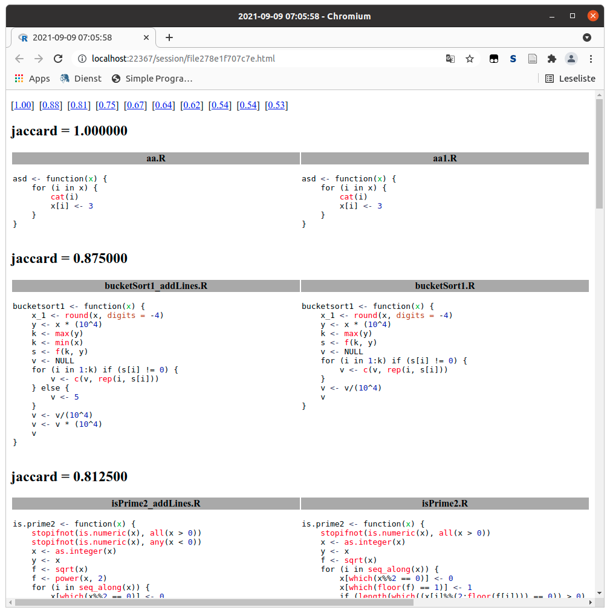

```{r, include = FALSE}
knitr::opts_chunk$set(
  collapse = TRUE,
  comment = "#>"
)
```

```{r setup, include=FALSE}
library("rscc")
```

## General

The R source code comparison is based on similarity coefficients for the names used in R programs or expressions. Use cases would be the detection of

* similar code sequences or
* plagiarism amongst students' assignments.

In the first case, detection of similar code sequences can lead to better code quality if similar code is embedded in a function rather than repeatedly in different places. In the second case, cheating is looked for.

The goal, however, is not perfect detection of similar code sequences, but rather to give clues as to where similar code sequences might be.

We have several steps to take:

1. read in the source code
2. create documents from source codes
3. calculate similarities
4. get an overview of the calculated similarities
5. compare code sequences

A thanks to Masatoshi Nishimura to his blog post [The Best Document Similarity Algorithm: A Beginner’s Guide](https://towardsdatascience.com/the-best-document-similarity-algorithm-in-2020-a-beginners-guide-a01b9ef8cf05) which is very inspiring.

### Example 1: Comparing whole files

```{r, eval=FALSE}
files <- ... # get file names from somehere, e.g. list.files()
prgs  <- sourcecode(files, title=basename(files))
docs  <- documents(prgs, type="names")
sim   <- similarities(docs)  # you may use alternatively tfidf()
dfsim <- matrix2dataframe(sim)
head(dfsim, n=25)
browse(prgs, dfsim, n=6)     # creates and opens a HTML file
```

### Example 2: Comparing expressions in files

```{r, eval=FALSE}
files <- ... # get file names from somehere, e.g. list.files()
# load all expressions with at least `minlines` lines
prgs  <- sourcecode(files, title=basename(files), minlines=0) 
docs  <- documents(prgs, type="names")
sim   <- similarities(docs)  # you may use alternatively tfidf()
sim   <- same_file(sim)      # do not compare expressions within one file
dfsim <- matrix2dataframe(sim)
head(dfsim, n=25)
browse(prgs, dfsim, n=6)     # creates and opens a HTML file
```

## Step 1: Reading in source codes

The makers of the package [SimilaR](https://CRAN.R-project.org/package=SimilaR) (R Source Code Similarity Evaluation) have provided some sample files for testing:

```{r}
files <- list.files(system.file("examples", package="rscc"), "*.R$", full.names = TRUE)
prgs  <- sourcecode(files, title=basename(files))
names(prgs)
```

The parameter `title` sets another title for the program instead of `files`.

The parameter `silent=TRUE` suppresses the output of the parsed files. If an error occurs during parsing, the file will not be loaded and will not be included in the following steps.

If you want to consider expressions and not the whole R file, you have to set the parameter `minlines`. `sourcecode` checks whether an expression in the source file has more than `minlines` lines. 
If so, the expression is kept for further analysis. The name of the list items in `prgs` is then `title[number]`. For example, you could access the expression named `prgs[["aa.R[1]"]]`.

```{r}
files <- list.files(system.file("examples", package="rscc"), "*.R$", full.names = TRUE)
prgs  <- sourcecode(files, title=basename(files), minlines=3, silent=TRUE)
names(prgs)
```

## Step 2: Create documents

The next step is to create documents, based on the names of variables, functions and operators from the parsed source codes.

```{r}
docs <- documents(prgs)
# create term document frequency table
freq_table(docs)[1:8,1:8]
```

With the `type` parameter you can distinguish between different types of names and with `ignore.case` the names are either treated case-insensitive or not.

### `type`

With the `type` parameter you can distinguish between different types of names:

```{r}
cat(as.character(prgs[[1]]))                       # source code
all.vars(prgs[[1]])                                # type="v", default
all.names(prgs[[1]])                               # type="n"
setdiff(all.names(prgs[[1]]), all.vars(prgs[[1]])) # type="f"
```

### `minlen` and `ignore.case`

With the parameter `minlen` you can exclude names that are shorter than `minlen`. The default is `minlen=2` because the name of an index variable in loops often consists of only one letter, for example `for (i in 1:n)`. `ignore.case` is either `TRUE` or `FALSE`. If `TRUE` (default), then names will case-insensitive, otherwise case-sensitive.

## Step 3a: Calculate similarity coefficients

In cluster analysis has been developed several similarity coefficients. They use words and basically calculate the intersection of words in documents over the union of words.

To calculate similarity coefficients between 
all source text segments based on the names used:

```{r}
files <- list.files(system.file("examples", package="rscc"), "*.R$", full.names = TRUE)
prgs  <- sourcecode(files, title=basename(files), silent=TRUE)
docs  <- documents(prgs)
similarities(docs)[1:8,1:8]
```

This calculates a matrix of Jaccard coefficients based on the variable names.

If the Jaccard coefficient is used then each entry can be interpreted as the percentage:

$$\frac{\text{number of words used in both documents}}{\text{number of all words used in both documents}}.$$
The interpretation will be different if another similarity coefficient is used! But in any case, a higher similarity coefficient corresponds to a larger proportion of variable names in both files (or expressions).

### `coeff` (similarity)

With the parameter `coeff` a certain similarity coefficient can be calculated (default: `jaccard`).

If you specify two sets with unique names `set1`, `set2` and one set `setfull` with predefined names, four
numbers will be calculated (default: `setfull <- unique(c(set1,set2))`):

```{r, eval=FALSE}
inset1 <- setfull %in% unique(set1)
inset2 <- setfull %in% unique(set2)
p      <- length(setfull)
n11    <- sum(inset1 & inset2)
n10    <- sum(inset1 & !inset2)
n01    <- sum(!inset1 & inset2)
n00    <- sum(!inset1 & !inset2)
```

The following coefficients can be calculated:

* `braun      = n11/max(n01+n11, n10+n11)`,
* `dice       = 2*n11/(n01+n10+2*n11)`,
* `jaccard    = n11/(n01+n10+n11)` (default),
* `kappa      = 1/(1+p/2*(n01+n10)/(n00*n11-n01*n10))`,
* `kulczynski = n11/(n01+n10)`,
* `matching   = (n00+n11)/p`,
* `ochiai     = n11/sqrt((n11+n10)*(n11+n10))`,
* `phi        = (n11*n00-n10*n01)/sqrt((n11+n10)*(n11+n10)*(n00+n10)*(n00+n10))`,
* `russelrao  = n11/p`,
* `simpson    = n11/min(n01+n11, n10+n11)`,
* `sneath     = n11/(n11+2*n01+2*n10)`,
* `tanimoto   = (n11+n00)/(n11+2*n01+2*n10+n00)`, and
* `yule       = (n11*n00-n01*n10)/(n11*n00-n01*n10)`.

If a coefficient name is not found or a `NaN` is generated then a zero is returned.

```{r}
files <- list.files(system.file("examples", package="rscc"), "*.R$", full.names = TRUE)
prgs  <- sourcecode(files, title=basename(files), silent=TRUE)
docs  <- documents(prgs)
similarities(docs, coeff="m")[1:8,1:8]
```

## Step 3b: Similarity based on term frequency–inverse document frequency (td-idf)

Another possibility to find similar source codes as cosine of angles of term frequency–inverse document frequency:

```{r}
files <- list.files(system.file("examples", package="rscc"), "*.R$", full.names = TRUE)
prgs  <- sourcecode(files, title=basename(files), silent=TRUE)
docs  <- documents(prgs)
tfidf(docs)[1:8,1:8]
```

The attribute `tfidf` of the result matrix contains the term frequency–inverse document frequency matrix.

## Step 4: Get an overview about the results

Since the matrix of coefficients can not easily be overviewed we have must transform them for visualisation.

### `matrix2dataframe`


With `matrix2dataframe` you transform the matrix of coefficients to a data frame where the first column 
is the row index, the second column the column index and the third column the the matrix entry.

```{r}
files <- list.files(system.file("examples", package="rscc"), "*.R$", full.names = TRUE)
prgs  <- sourcecode(files, title=basename(files), silent=TRUE)
docs  <- documents(prgs)
simm  <- similarities(docs, coeff="m")
simdf <- matrix2dataframe(simm)
head(simdf, 10)
```

As you can see the lines are ordered by decreasing values. The parameter `decreasing=FALSE` will order it by ascending order.

The output can be interpreted line by line:

* The variable names used in the files `aa.R` and `aa1.R` are identical. Each variable name used in
`aa.R` is also used in `aa1.R` and vice versa. 
* The variable names in the files `bucketSort1_addLines.R` and `bucketSort1.R` are identical.
* The variable names in the files `isPrime2_addLines.R` and `isPrime2.R` are identical.
* The variable names in the files `kombinuj1_variables.R` and `kombinuj1.R` are **not** identical. In both files, the variable names overlap by 30%.
* And so on.

In case of a symmetric similarity matrix only the upper triangle is considered otherwise the whole matrix.

You may use a `stripchart` to see all similarity coefficients:

```{r, fig.height=3}
stripchart(simdf[,3], "jitter", pch=19, xlab=names(simdf)[3])
```

### `as_igraph`

In a second step you can plot the coefficients in a diagram, where thicker edges correspond to higher similarity coefficients.

```{r}
library("igraph")
files <- list.files(system.file("examples", package="rscc"), "*.R$", full.names = TRUE)
prgs  <- sourcecode(files, title=basename(files), silent=TRUE)
docs  <- documents(prgs, type="n", minlen=3)
simm  <- similarities(docs)
graph <- as_igraph(simm, diag=FALSE)
# color all edges wit a large similarity coefficients in red
E(graph)$color <- ifelse(E(graph)$weight>0.4, "red", "grey")
plot(graph, edge.width=1+3*E(graph)$weight)
box()
```

The package [igraph](https://CRAN.R-project.org/package=igraph) is used for the graphical representation. In `as_igraph` the function `igraph::graph_from_adjacency_matrix` is used. In case of a symmetric coefficient matrix, undirected graphs are used, otherwise a directed graph is used.

### `same_file`

If you are only interested in the differences between files, you can set the similarities between expressions
to some predefined value (default: zero) if they are in the same file. The use case here is to detect plagiarism in different files.

```{r}
files <- list.files(system.file("examples", package="rscc"), "*.R$", full.names = TRUE)
prgs  <- sourcecode(files, title=basename(files), silent=TRUE, minlines=1)
docs  <- documents(prgs)
simm  <- similarities(docs)
simm[1:3,1:3]
simm  <- same_file(simm)
simm[1:3,1:3]
```

## Step 5: Detailed analysis of the source code

The last step is to compare the relevant source codes. The command `browse` creates and opens an HTML page with the source codes side by side.

```{r, eval=FALSE}
files <- list.files(system.file("examples", package="rscc"), "*.R$", full.names = TRUE)
prgs  <- sourcecode(files, title=basename(files), silent=TRUE)
docs  <- documents(prgs, type="n", minlen=3)
simdf <- matrix2dataframe(similarities(docs))
if (interactive()) browse(prgs, simdf, simdf[,3]>0.4)
```


